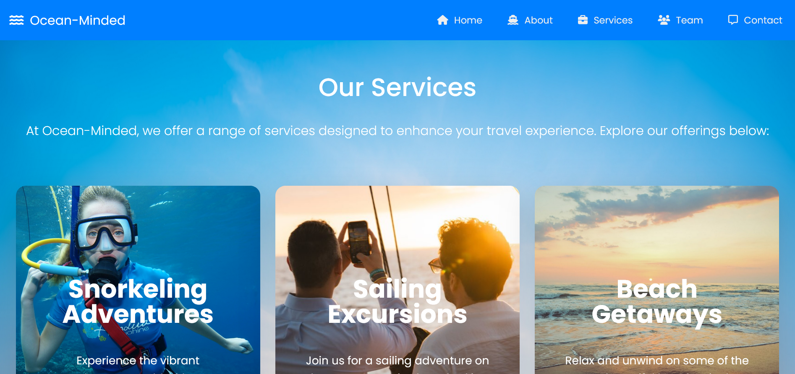

# 🌊 Ocean-Minded: Dive into Beautiful Ocean Adventures! 🌊

  Welcome to the Ocean-Minded project! This web application is designed for a travel company that specializes in creating wonderful experiences that connect clients with the beauty of the ocean world.

- [🌊 Ocean-Minded: Dive into Beautiful Ocean Adventures! 🌊](#-ocean-minded-dive-into-beautiful-ocean-adventures-)
  - [Interface 🌐](#interface-)
  - [Why Choose Us? 🙌](#why-choose-us-)
  - [Technologies Used 🛠️](#technologies-used-️)
  - [Getting Started ✨](#getting-started-)
  - [Usage 🏄‍♂️](#usage-️)
  - [Support My Work ☕](#support-my-work-)
  - [Contact Me 💬](#contact-me-)

<a name="interface"></a>

## Interface 🌐

&nbsp;&nbsp;The interface is designed to be user-friendly and visually appealing, ensuring that users can easily navigate through the ocean adventures and experiences offered.

<!--prettier-ignore-->

<p align="center"><em>The Ocean-Minded Interface</em></p>

<a name="why-choose-us"></a>

## Why Choose Us? 🙌

&nbsp;&nbsp;At Ocean-Minded, we curate unique experiences that connect you with the wonders of the sea. Here’s why you should choose us:

- **Expert Guides**: our knowledgeable guides are passionate about the ocean and are here to ensure you have the best experience possible.
- **Sustainable Practices**: we prioritize eco-friendly practices to protect our oceans for future generations.
- **Tailored Experiences**: from family vacations to romantic getaways, we customize our packages to suit your needs.

<a name="technologies-used"></a>

## Technologies Used 🛠️

&nbsp;&nbsp;I leverage modern technologies to provide you with a seamless online experience:

- **HTML5**: for structuring the web application, ensuring semantic markup and improved SEO.
- **CSS3**: for styling and layout, including responsive design techniques that enhance user experience across devices.
- **JavaScript**: for dynamic content updates and user interactions, providing a smooth and interactive experience.
- **Node.js**: a JavaScript runtime built on Chrome's V8 engine that allows me to execute JavaScript on the server side. It enables the development of scalable and high-performance applications, leveraging non-blocking I/O and an event-driven architecture to handle multiple connections simultaneously.
- **Express.js**: a Node.js web application framework that provides a robust set of features for building web and mobile applications. It simplifies the development process by offering a variety of middleware to handle requests, responses, and routing efficiently.
- **EJS**: a templating engine that allows me to generate HTML markup with plain JavaScript. It enables dynamic content rendering on the server side, making it easy to create reusable templates and maintain a clean separation between my application logic and presentation.

<a name="getting-started"></a>

## Getting Started ✨

&nbsp;&nbsp;To get started with the Ocean-Minded, follow these simple steps:

1. **Clone the repository**

```bash
git clone https://github.com/PrimeSolar/ocean-minded.git
cd ocean-minded
```

2. **Install dependencies**
   Ensure you have Node.js installed. Then run:

```bash
npm i
```

3. **Start the application**

```bash
npm start
```

or

```bash
node index.js
```

4. **Open your browser**
   Navigate to `http://localhost:3000` to dive into the Ocean-Minded experience!

<a name="usage"></a>

## Usage 🏄‍♂️

&nbsp;&nbsp;Once the server is running, you can explore the web application for the travel company. Your sea adventure awaits!

## Support My Work ☕

&nbsp;&nbsp;If you enjoy my project and would like to support my work, consider buying me a coffee! Your contributions help me stay energized and motivated to create even more amazing content.

&nbsp;&nbsp;Every cup of coffee you buy not only fuels my passion but also allows me to dedicate more time to developing innovative projects and sharing knowledge. Whether it's a small gesture or a generous contribution, every bit is greatly appreciated!

**Click the image to support my work:**

<a href="https://coff.ee/cocacola">
  
</a>

&nbsp;&nbsp;Thank you for your support! Together, we can create something wonderful! 💖

<a name="contact-me"></a>

## Contact Me 💬

&nbsp;&nbsp;LinkedIn [@PepsiCo](https://www.linkedin.com/in/PepsiCo/)


